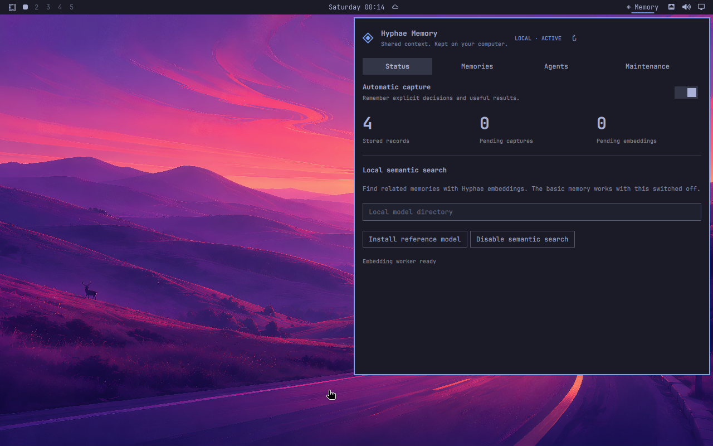

# Hyphae Memory for Omarchy

Local, durable memory shared by Claude Code, Codex, OpenCode, Pi and other MCP
clients. A native Omarchy widget opens a panel for memories, capture controls,
agent connections, verified queries and backups.

This repository is a development candidate. It includes upstream Hyphae
changes that are not in the published 3.0.0 crates. Use the reviewed runtime
bundle built from `source.lock.json`; a stock 3.0.0 binary is insufficient.



## What it does

- Stores memory in one user-owned Hyphae directory with native WAL durability.
- Keeps project scopes separate; sharing a memory globally is explicit.
- Captures explicit decisions, facts, constraints and reported successful
  allowlisted commands. Global and project pause controls are available.
- Uses Hyphae's existing Candle embedding engine when semantic search is
  enabled. The default is lexical search; hybrid mode uses RRF without reranking.
- Generates complete memory proofs on request and verifies them offline.
- Preserves memories and backups when the integration or widget is removed.

Automatic context is limited to 2,000 UTF-8 bytes and a one-second recall
deadline. Captured commands expire after 30 days. Decisions, facts and
constraints have no default expiry. Opaque command outcomes are skipped.
Model journal entries are public historical notes; hidden reasoning is never
captured. Stored text is historical evidence and cannot override current
instructions.

## Install and use

Install the plugin with Omarchy's plugin installer or copy its source directory
to `~/.config/omarchy/plugins/org.hyphaeresearch.memory`, then validate and enable
it with `omarchy plugin validate` / `omarchy plugin enable`.

For local review, the complete offline archive is
`dist/hyphae-memory-0.1.0.tar.gz`. Extract it into
`~/.config/omarchy/plugins`, validate the extracted plugin directory, and enable
`org.hyphaeresearch.memory`. It includes the matching runtime. Python 3.11+
and Linux x86_64 are required. No public runtime download is configured until
the owner publishes the reviewed assets.

Open **Memory** in the bar, install the verified runtime, then choose **Set up
local memory**. A packaged plugin contains the matching runtime archive in
`dist/`; a source checkout can use a locally built archive. The installer checks
the archive digest and every member before making it available.

In **Agents**, connect the installed clients. Reading tools are the default;
writing tools have a separate control. Codex requires review of the generated
hooks with `/hooks`. Updating a hook can require a new review in Codex.

In **Memories**, select a project and layer, search, add a fact/decision, or
forget a live memory. Use **Share across projects** only for intentionally
global facts. **Verify query** creates and checks a complete proof of that
query. **Maintenance** provides health checks, verified backup, restore and
removal. Edited agent entries are preserved and must be reviewed before
reconfiguration or removal.

## Optional local semantics

Choose **Install reference model**, then **Enable semantic search**. This
downloads the exact BGE model revision in [models.lock.json](models.lock.json).
The reference model is English-oriented; the bilingual evaluation records its
behavior without making a universal quality claim. Another compatible local
model can be selected by directory and is identified by its file fingerprint.
No alternate embedding engine or cloud embedding account is used.

Enabling or changing a model first creates a verified backup, copies and checks
the live records, commits the new native profile, then retires the old one.
Interrupted copies can be retried; an interrupted committed cutover is recovered
before service start. Captures wait in a durable spool during downtime.
Background enrichment never revives a forgotten, expired or changed source.
If the worker is unavailable, lexical memory continues to work.

## Data and verification

| Resource | Default location |
| --- | --- |
| Memories | `~/.local/share/hyphae/agent-memory` |
| Backups | `~/.local/share/hyphae/backups` |
| Policy and credentials | `~/.config/hyphae` |
| Sanitized capture spool | `~/.local/state/hyphae/agent-hooks` |
| Runtime bundles | `~/.local/share/hyphae-omarchy/runtimes` |
| Model files | `~/.local/share/hyphae/models` |

XDG directories are respected. There is no home-directory indexing or cloud
synchronization. The user services are `hyphae-agent-memory.service`,
`hyphae-agent-memory-maintain.timer`, and the optional
`hyphae-agent-embed.service`.

A memory proof seals the query, common snapshot, lifecycle eligibility,
candidate execution, ordered result and embedding provenance. It proves
retrieval at that snapshot, not the truth of a statement or independent model
execution. Witness files can contain retained directory data and stay private.
Retain the anchor separately for independent verification. Forget/expiry removes
live recall; historical versions and backups are not a secure-erase guarantee.

Complete proofs share the native protocol's 16-MiB response limit, including
their witnesses. Larger retained histories can exceed that bound; ordinary
recall remains available, and the verification action reports the limit.

Other MCP clients can invoke the installed `hyphae mcp --profile memory` binary
against the same managed Unix endpoint, with `HYPHAE_NATIVE_API_KEY_FILE`
pointing at `memory-reader.key` (or the writer credential with `--allow-write`).
`hyphae agent status` shows the managed paths. Credential contents never belong
in command arguments, logs or shared configuration.

## Development and review

The thin QML/Python plugin owns presentation and pinned artifact installation.
Memory operations, policy, migration, capture and host adapters live upstream
in Hyphae. Validation reports and release artifacts are prepared under `docs/`
and `dist/`. The persistent development checkout is `.upstream/hyphae`.

```bash
python3 -m unittest discover -s tests -p 'test_*.py'
python3 scripts/stage-plugin.py
python3 scripts/build-runtime.py --source /path/to/reviewed/hyphae
python3 scripts/package-plugin.py
```

The runtime build checks a clean, exact source revision and uses locked Cargo
dependencies. Tests include native proof/lifecycle regressions, cross-SDK
wire fixtures, pinned host CLIs and lifecycle APIs, and the real Omarchy VM.
The evaluation fixture is deliberately small and curated; its metrics do not
establish performance on production histories or superiority over other systems.

See [the Omarchy publishing guide](https://plugins.omarchy.org/publish.html),
[Hyphae](https://github.com/Hyphae-Research-Foundation/hyphae), and
[NOTICE](NOTICE) for source and licensing information. Publication is a separate
owner-reviewed step.

The [validation report](docs/VALIDATION.md) records the tested candidate,
measurements, screenshots and limits. The [development guide](docs/DEVELOPMENT.md)
contains the reproducible checks and VM workflow. The [marketplace draft](docs/MARKETPLACE.md)
provides the proposed listing and remaining owner submission steps.
