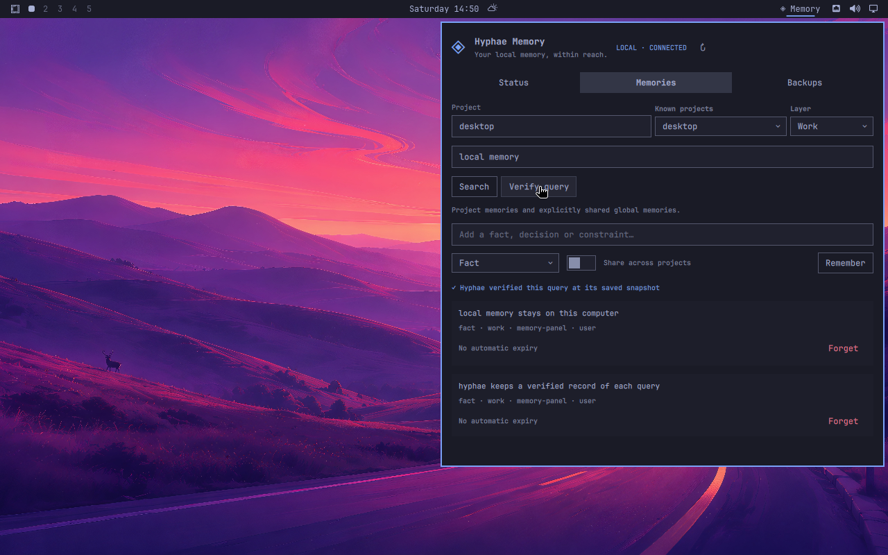

# Hyphae Memory for Omarchy

A native Omarchy panel for an independently managed local Hyphae memory service.
Search and save memories, verify queries at their recorded snapshot, and create
verified backups. Project scopes and explicitly shared global memories stay
visible in the panel.

Version 0.2.0 is a desktop client for the dedicated `hyphae-memory-panel-v1`
interface. The service enforces its memory-only authority through a separate
Unix socket and credential.



## Install

Use Omarchy 4.0.3 or newer on Linux with Python 3.11+:

```bash
omarchy plugin add https://github.com/Hyphae-Research-Foundation/hyphae-omarchy.git
omarchy plugin enable org.hyphaeresearch.memory
```

When upgrading from 0.1, restart the desktop shell with
`omarchy restart shell` after updating the plugin so Qt loads the new interface.

An offline client archive is available in the
[0.2.0 release](https://github.com/Hyphae-Research-Foundation/hyphae-omarchy/releases/tag/v0.2.0).
Extract it into `~/.config/omarchy/plugins`, validate the extracted directory
with `omarchy plugin validate`, then enable its widget.

## Connect to Hyphae

Prepare Hyphae and its dedicated desktop connection independently using the
[Hyphae memory-panel guide](https://github.com/Hyphae-Research-Foundation/hyphae/blob/main/docs/memory-panel.md).
A build providing the version-1 memory-panel interface is required. Older
Hyphae 3.0.0 registry packages predate this interface.

The client reads `~/.config/hyphae-panel/client.json` (respecting
`XDG_CONFIG_HOME`). `HYPHAE_MEMORY_PANEL_CONFIG` can select another connection
file. Hyphae creates the file with its dedicated endpoint and credential; keep
it private. The file, socket and their parent directories must belong to the
current user and exclude access by other users. Refresh the panel after the
service becomes available.

The plugin's connection grants only memory data, query/proof and backup
operations. Hyphae runtime installation, service administration, model setup
and external tool integrations belong to the independently managed application.
See the [protocol and authority boundary](docs/PROTOCOL.md).

## Use the panel

**Status** shows the connection, record count and search mode provided by
Hyphae. **Memories** lets you select or enter a project, search by layer, save
a fact/decision/constraint, and confirm forgetting a memory. **Share across
projects** explicitly creates global memory. Enter submits a query; Escape
cancels a confirmation or closes the panel.

**Verify query** asks Hyphae to generate and verify the complete memory proof
at the saved snapshot. The panel displays its verification result. A proof
establishes retrieval at that snapshot; it does not establish the truth of a
remembered statement. Native proof responses retain their 16-MiB limit.

**Backups** lists and creates backups for this dedicated interface. Hyphae
keeps them under its memory backup directory's `panel` subdirectory. Restoring
backups and administering the service are separate Hyphae operations.

## Remove

```bash
omarchy plugin disable org.hyphaeresearch.memory
omarchy plugin remove org.hyphaeresearch.memory
```

Removing the client preserves the independently installed Hyphae service,
memories, models, credentials and backups. Manage those resources in Hyphae.

## Development

```bash
python3 -m unittest discover -s tests -p 'test_*.py' -v
python3 scripts/package-plugin.py
```

See [development](docs/DEVELOPMENT.md), [validation](docs/VALIDATION.md), and
[release notes](docs/RELEASE.md). The source is Apache-2.0; [NOTICE](NOTICE)
identifies the independent components.
